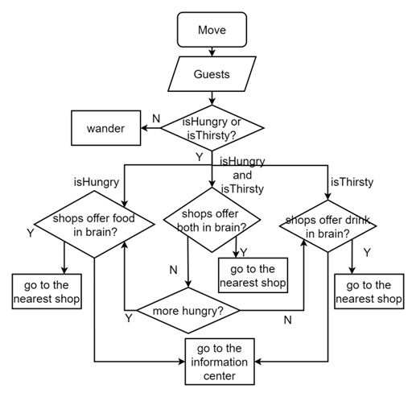

In total, five types of agents were created: Center, Guest, Guard (for challenge 2 use), GuestWithoutBrain and Shop. All things are randomly set (except the location of the info center). The numbers of each types are: 1 info center, 20 guests (only maximum 10 of them will turn bad for challenge 2 use), 10 guestsWithoutBrain (which are used to compare and calculate the decreased distance), 4 shops.

## **Global:**
**shopMap:** a dictionary containing lists of shops corresponding to three types.

**getBadGuestsList:** a list containing all bad guests in the type of Guest.

**reflex results:** when arriving the set maximum cycles, the codes are run to calculate the distances reduced by using the brain comparing to without using it.

## **Center:** 
**nearest xxShop:** the “xx” stands for the type of the shop (food, drink, both), these are Shop type instances writing down the closest corresponding types of shops to the information center in distance.

**badGuestsVisited:** a list containing all bad guests who have just visited the center.

**Reflex reportBadGuests:** report bad guests infos when they visit the center each time by passing the badGuestsVisited list to the guard.

## **Guest:**

**xxValue:** the “xx” stands for hungry or thirsty, is the current value status reflect how much the guest feeling hungry or thirsty.

**isxx**: the “xx” stands for hungry or thirsty, is the bool value telling if the guest feeling hungry or thirsty.

**brain:** a dictionary containing a list of shops corresponding to different types.

**turnBad:** it is a bool value telling if the guest bad, which is used for challenge 2.

**shopDistance:** a dictionary containing a list of distance between shops in brain and guests’ current location corresponding to the types of shops.

**reflex hungryAndThirsty:** each cycles, the xxValues decrease randomly, while they are below certain standards, guests will become hungry or thirsty by flip isxx.

**reflex rememberNearShops:** the shops and their types are written in the brain when the shops are inner the distance of horizon.

**reflex move:** series of actions of the guests, details are in the Graph 1 below.

**reflex resetAttributes:** when reaching the shops, reset xxValue according to the type.

**reflex askInfos:** update information of all shops to the brain, and recognized to the badGuestsVisited list, if the guests are bad.

## **Guard:**
**killList:** a list containing all bad guests having visited the center.

**reflex killBad:** if bad guests reported, go to locations of them and kill when reaching.

## **Shop:**
offerxx: the shop offers “xx” (food or drink), which are randomly generated.

**Challenge 1:** the guests with brain will react as the action “move” in graph 1, those who without brain will go and ask the nearest shops and go for them every time feeling hungry or thirsty. Then count the cycles when the both types of guests feeling hungry or thirsty, which are the distance traveled during this period by multiply the speed. After 100,000 cycles, calculate how much distance is reduced by using brains (as for Guest, only remained 10 good guests are involved). The result is around 40,000.

**Challenge 2:** the 10 guests in total from the 20 guests will turn bad by the probability 0.5%. After turning bad, the bad guest will immediately go to the center for fight, and the center will report the event to the guard. And the name of this bad guest is written on the killList. Then the guard will find and kill him.
The process of the assignment 1 is in Graph 2 below.
 
**Graph 1:**
 

**Graph 2:**
