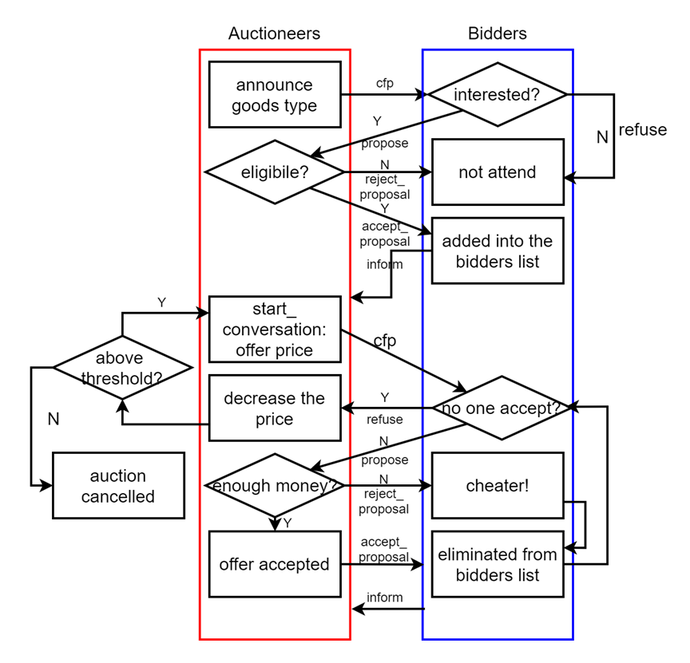
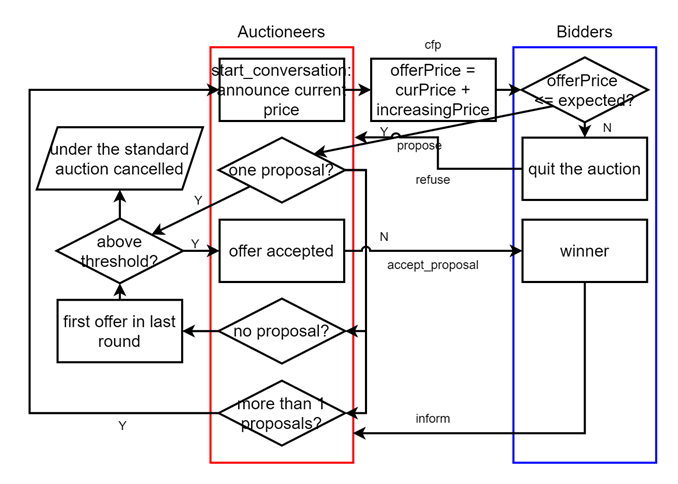
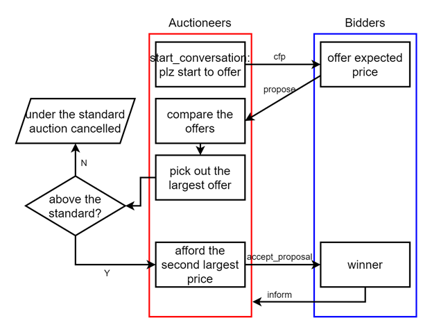

# Challenge 1
There are three types of goods: [‘cloths’, ‘CDs’, ‘cups’], which are aligned to different three auctioneers. At the very beginning, the auctioneers start the conversations by sending **cfp** messages announcing what they are selling. And the bidders can respond propose type messages to the corresponding auctioneer if they are interested. After auctioneers check their eligibility, the auctions are ready. 

In Dutch Auction, the auctioneer will use **start_conversation** to send **cfp** messages which contain the price offered. The bidders will compare the offer with their expected price. If the offer is not acceptable, they will use **refuse** messages to say no. Then the auctioneers will reduce the price. If the decreased price is higher than the lower bound, the auctioneers will offer it again till a winner occurs or the price is below the standard. 

If the offer is accepted by the bidders, they will send **propose** messages with their budgets attached. And the auctioneers will check if they have enough budgets to afford the offer of price. If not, the bidder is a cheater, who will be forbidden in the following auctions by being sent a **reject_proposal** message. If the bidder is eligible, he will be sent **accept_proposal** message as a winner. Finally, he can send an **inform** to end the conversation. The whole process is below in graph 1.

**Graph 1: Process of Dutch Auction Using FIPA Protocol**

# Challenge 2
Implement three types of auctions: [‘Dutch’, ‘English’, ‘Vickrey’] and compare them. For convenient comparison, assume no cheats (bidders will not propose offers higher than the budgets) in the auction.

As for the English auction, the bidders will offer new price if the price is no larger than their expectations. And the auctioneer will accept the proposal, if the offer is above the lower-bound and only one bidder remained. In case of no proposals in a current round, the auctioneer will accept the first offer in last round, which refers the first one call out the new price. Also, this new price should be above the bound. The process is shown in graph 2.

Vickrey auction is an auction that bidders offer the price at very beginning. Then the auctioneer will pick out the largest offer, if this offer is above the standard, the bidder wins and pays the second largest price. The process is shown in graph 3.

**Graph 2: Process of English Auction Using FIPA Protocol**

**Graph 3: Process of Vickrey Auction Using FIPA Protocol**
