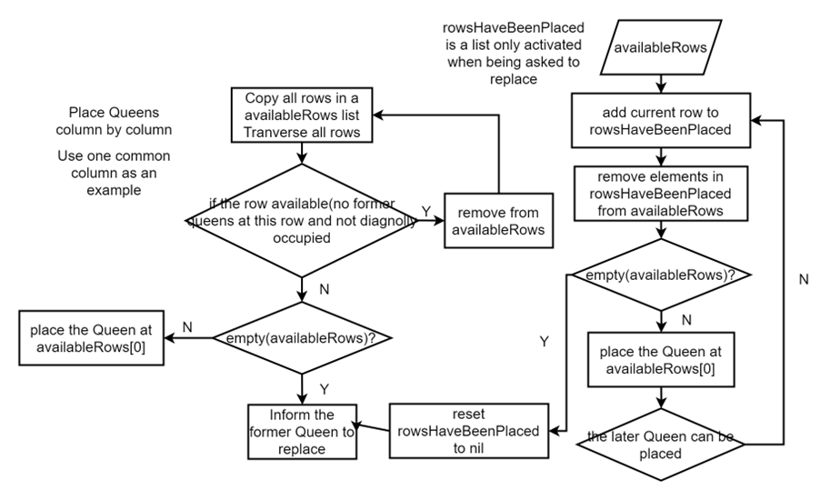
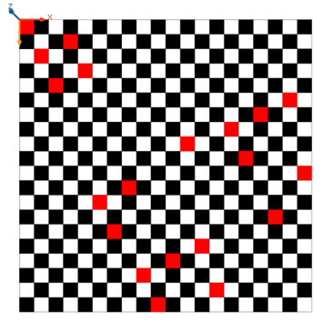
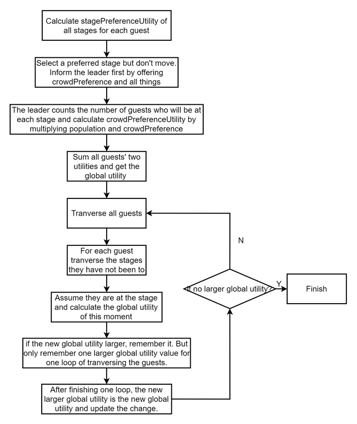

Place the Queens column by column. First, assume all rows in a column are available to place (added to the list **availableRows**). Then check if there are former queens occupying cells on the row or on the left upper or lower diagonal cells. If yes, remove those rows from ****availableRows****. Second, check if the **availableRows** empty, if no, just put the queen on the first cell (**availableRows**[0]). If yes, inform the predecessor to replace. 

If a queen is asked to replace, she begins to remember the cell having stayed by adding the rows to **have Been Placed Rows**. Then remove the rows in this list from **availableRows**. Check again if **availableRows** empty. If yes, reset **have Been Placed Rows** to nil and forbid to use it till be asked to replace again. If no, place her at **availableRows**[0] and check if the later queen can be placed again. While a queen is successfully placed, then inform the successor. 

The main detail is to maintain the list **availableRows** and always put the queen at the first element in the list if not empty.

**Graph 1-1: The main process of Task 1**

**Graph 1-2: The result of 20 Queens**

The stages will inform both the leader and guests their attributes. And the guests will calculate them with their preference to get the stage preference utility. They then will choose the stage with the largest utility, and inform the leader about this first. 

The leader will count the population at each stage and calculate the crowd mass utility by multiplying the guests’ crowd preference and population. Then sum the two types utility of each guests to gain the global utility. Worthy saying, to make the crowd preference dominant, the values of the stage preference utility have been normalized, which make the crowd mass dominant about 80% of the decision.

Then use greedy algorithm to get the best global utility. Assume all guests can be reassigned to the other stages, then we can result in the guest going to the stage with a better global utility. And this global utility should be the largest among this loop. Then update the change, to run another loop until the global utility unchanged anymore. At this time, we get the largest global utility. 

Finally, the leader inform the guests of the ultimate map telling where they should go.

**Graph 2: The main process of Task 2 and the Challenge**
