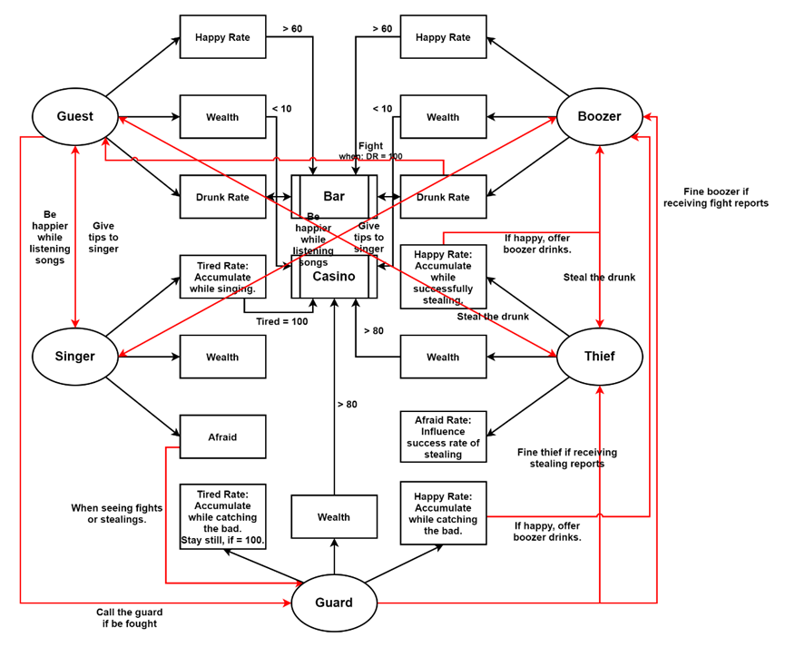
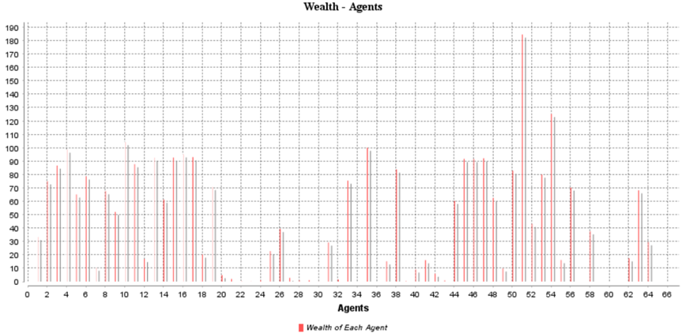
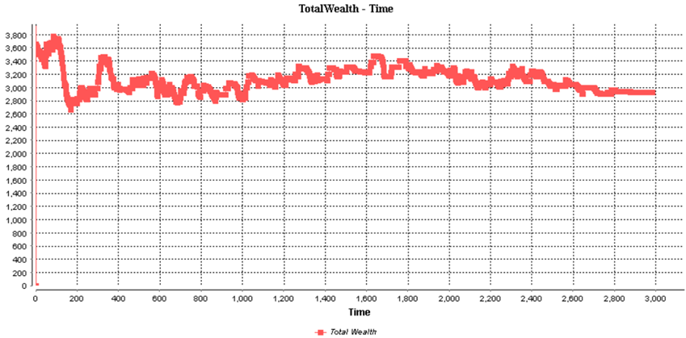
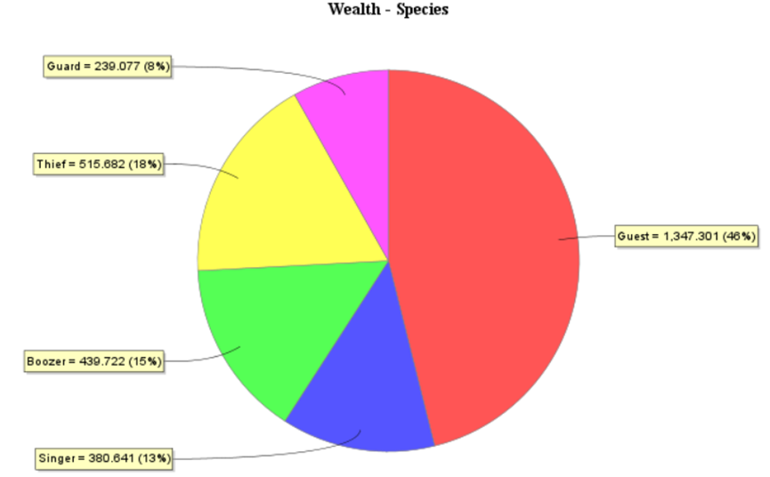

# 1. Introduction
The project contains five different types of characters, Guest, Singer, Boozer, Thief and Guard, who are created as separate species. There are two different types of places, Bar and Casino, where different agents can go according their rules or plans. Sometimes, they will meet there and react to each other.

Guest has three attributes, happyRate, wealthRate and drunkRate. Singer has tiredRate, wealthRate and afraid. Boozer has same attributes as Guest. Thief has happyRate, wealthRate and afraidRate (which is different from the Singer’s). Guard has happyRate, wealthRate and tiredRate.

The project uses simple_bdi to control the behaviors of the agents, and uses FIPA skill to allow agents to communicate with each other For the simulation, 2 bars and 2 casinos are created, and 20 guests, 20 singers, 10 boozers, 5 thieves, and 10 guards are involved. 

While cycles running, three types of charts will show different data and values. Chart 0, which is a series bar chart, shows the wealth of each agent. Chart 1 is a series map using spline, giving the changes of total wealth according to time. The last chart, Chart 2 is a pie chart, where different types of agents occupy the areas corresponding to their species’ wealth.

# 2. Relationships and Interactions
Guest is a basic specie in the project. They will do wander desire if no other intentions. When they see singers singing inner their horizons and they have enough money for tips, they will stay and listen songs, then they give tips to the nearest singer and gain happiness. In the case of insufficient money, they will go to the nearest casino to win money. At the point of gaining enough happy rate, they will go to the nearest bar to have some drinks, which costs their wealth as well as increases the drunk rate. In special cases, such as being kicked by boozers or stolen by thieves (not realize the stealing), they will feel unhappy. But if they realize the thief has stolen them, they will happy for having protected their possessions and call a guard.

Singer is a specie for providing happiness. But the singers will accumulate tiredness during singing. If they are tired, they will go to the nearest casino and lose some money. Another action they will take is being afraid and going to a nearest guard to report if they have seen fight or stealing cases.

A boozer act basically like a guest. But they will seek fights with guests if they are drunk. Of course, they will be fined by these bad behaviors when being caught by a guard.

The thieves will steal those who are drunk. And they have a success rate of stealing according their afraid rate. If they successfully steal, they will feel happy and get the money safely. If not, they will be reported to guards and get caught to be fined, which will make them unhappy but will decrease the afraid rate. In case of being happy, they will go to a bar to buy a boozer drinks.

**SuccessRate = 100 - afraidRate**

Guards will process the reports and conduct to catch bad and fine them. They will accumulate wealth via fining. When they have enough money, they will go to a casino to lose money. While catching the bad, they will accumulate both happy rate and tired rate. If they are happy, they will go to a bar buying a boozer drinks. And if they are tired, they just stay still to rest and have no responds to the reports.

The map of relationships and interactions are as below in **Fig 0**.

**Fig 0: Relationships and Interactions**

# 3. Results and Conclusion
The wealth of each agent is showed in **Chart 0**. The changes of total wealth in the simulation are in **Chart 1**. The wealth of each specie is compared in the pie chart in **Chart 2**.

**Chart 0: Wealth of Agents**

**Chart 1: Total Wealth**

**Chart 2: Wealth of Species**

Except the results above. An interesting conclusion is occurred. While increasing the number of guards (30), the profit thieves can gain will decrease, which indicates a better security. Details are compared in the **Table 0**.

**Table 0: Wealth of Thief with Different Number of Guards**
|Number of Guards|Wealth of Thief Speice|Percentage|
|:---:|:---:|:---:|
|10|515.682|18%|
|30|440.951|14%|